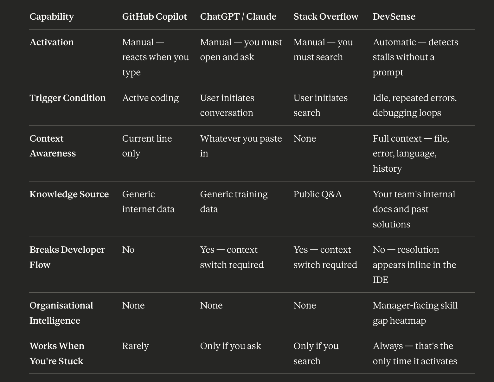
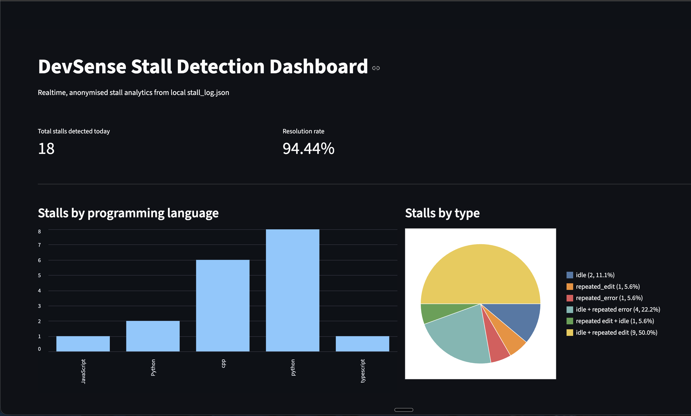

# 🧠 DevSense AI

DevSense AI is a non-intrusive, intelligent developer productivity engine. It proactively identifies "code stalls"—periods of friction caused by persistent bugs or syntax loops—and delivers surgical, AI-powered resolutions directly within the VS Code environment. Powered by the Groq LLaMA-3 inference engine, DevSense eliminates context-switching by projecting real-time fixes exactly where they are needed.
---

## 🎯 The Problem
Developers frequently get stuck in code stalls (idle loops, repeated errors, and code thrashing) without fast, observable insights. Existing AI tools often require developers to context-switch to a chat window or manually prompt the AI. 

## 🚀 Our Solution
DevSense AI lives entirely in the background. It watches the developer's flow natively inside VS Code and **only interrupts when it detects the developer is struggling**. It then uses **LLaMA-3.3-70b via Groq** to instantly generate a solution, projecting it right above the broken code.

### ✨ What It Does
- 💡 **Explains the Root Cause:** A one-line explanation of why the code broke.
- ⚡ **Shows the Fix Inline:** A specific, actionable summary of the required fix.
- ✨ **Applies the Fix Automatically:** An interactive CodeLens button that natively rewrites the broken code in the editor with a single click.

### 📊 Why DevSense Is Different


### 🕵️‍♂️ How it Detects Stalls (Core Trackers)
The master `StallDetector` fires off our AI resolution engine when it detects overlapping stall signals in the active file. Today, the detector looks for combinations of:
1. 🕒 **Idle Tracker**: Detects when a developer stops typing or moving their cursor for about 10 seconds while the file remains in a broken state.
2. 🐛 **Persistent Bug Tracker**: Detects when the same diagnostic error (from Pylance, IntelliSense, etc.) persists across multiple edits.
3. 🔄 **Code Thrashing Tracker**: Detects when a developer repeatedly edits the same code block 3+ times without successfully resolving the issue.
4. ▶️ **Repeated Failed Runs**: Detects when the same file keeps failing during repeated terminal or task executions.
5. 📉 **Lack Of Progress**: Detects when errors remain active after multiple edits and failed runs without improvement.

---

## 🏗️ Architecture & Tech Stack

- **Frontend (VS Code Extension)**: Built in **TypeScript**. Uses WebSockets for real-time payload delivery and VS Code's native `CodeLensProvider` to inject AI suggestions inline without breaking developer flow.
- **Backend Server**: Built with **FastAPI / Python**. A lightweight WebSocket server routing editor context and active compiler configurations to the LLM.
- **AI Brain**: Powered by **Groq (`llama-3.3-70b-versatile`)** for extremely low-latency, highly contextual code diagnostics.
- **Telemetry Dashboard**: Built with **Streamlit**. Reads our `stall_log.jsonl` output to visualize team bottlenecks, stall distribution by language, and AI resolution success rates.

### 📈 Dashboard Preview


---

## 🛠️ How to Run the Project Locally

### 0. Clone the Repository
If you are testing DevSense on a new machine, start by cloning the repository and creating a Python virtual environment.

```bash
git clone https://github.com/Charan-suresh/DevSense_AI.git
cd DevSense_AI
python3 -m venv .venv
source .venv/bin/activate
```

### 1. Backend Server Setup
Start by configuring the environment strings and launching the Python backend.

```bash
# 1. Activate the virtual environment and install dependencies
source .venv/bin/activate
pip install -r requirements.txt

# 2. Add your own Groq API Key to the .env file
echo "GROQ_API_KEY=gsk_your_api_key_here" > .env

# 3. Launch the FastAPI WebSocket Server
export $(cat .env | xargs) && python -m uvicorn backend.main:app --host 0.0.0.0 --port 8000 --reload --reload-exclude .venv
```

The backend must be running before the VS Code extension can send a stall payload and receive an AI-generated fix.

### 2. VS Code Extension Setup
Now, start the Extension Development Host window.

```bash
# In a new terminal window:
cd stall-detector
npm install
npm run compile
code --extensionDevelopmentPath=$(pwd) ../
```
*Alternatively: Open the `stall-detector` folder inside VS Code and hit **F5** to automatically attach the debugger.*

When the extension is active, DevSense surfaces suggestions inline with CodeLenses and also shows a visible VS Code notification when a resolution arrives.

### 3. Open the Analytics Dashboard (Optional)
Run the local telemetry dashboard to see anonymized stall tracking in real-time.
```bash
# In another terminal window:
streamlit run dashboard/app.py
```

#### 🌍 Sharing the Dashboard Worldwide
To make your locally running dashboard accessible over the internet without deploying it, expose port `8501` through **[ngrok](https://ngrok.com/)**:

```bash
# 1. Install ngrok, if needed
brew install ngrok/ngrok/ngrok

# 2. Start a secure tunnel to the dashboard
ngrok http 8501
```

---

## 💡 How to Test it Live
1. In the **Extension Development Host** window, open any Python or C++ file.
2. Intentionally type a blatant syntax or logic error (e.g., `print(undefined_variable)`).
3. Wait for the standard red squiggly line to appear under the error.
4. Make a few edits that do not fix the problem, or repeatedly run the broken file from the VS Code integrated terminal.
5. Stop typing and leave the cursor idle for about 10 seconds.
6. DevSense will detect overlapping stall signals and ping the local WebSocket backend -> Groq.
7. You should see both a VS Code notification and a set of three CodeLenses in the editor:
   - 💡 An explanation of the problem.
   - ⚡ A summary of the fix.
   - ✨ An interactive **Apply Fix** button.
8. Click **✨ Apply Fix** to see the code instantly and automatically repaired.
