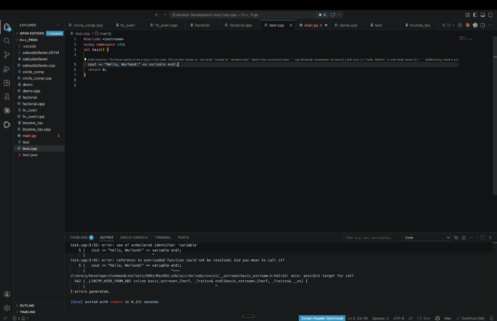

# 🧠 DevSense AI


**DevSense AI** is an intelligent VS Code extension and analytics platform that automatically detects when developers are stuck—or "stalled"—and instantly provides AI-powered, surgical code resolutions directly inline, using the blazing-fast Groq API.

---

## 🎯 The Problem
Developers frequently get stuck in code stalls (idle loops, repeated errors, and code thrashing) without fast, observable insights. Existing AI tools often require developers to context-switch to a chat window or manually prompt the AI. 

## 🚀 Our Solution
DevSense AI lives entirely in the background. It watches your flow natively inside VS Code and **only interrupts you when it detects you are struggling**. It then uses **LLaMA-3.3-70b via Groq** to instantly generate a solution, projecting it right above your broken code as a CodeLens.

### 🕵️‍♂️ How it Detects Stalls (Core Trackers)
The master `StallDetector` fires off our AI resolution engine when it detects an overlap of any 2 of our 3 proprietary trackers:
1. 🕒 **Idle Tracker**: Detects when a developer stops typing or moving their cursor for 25 seconds immediately after a code error.
2. 🐛 **Persistent Bug Tracker**: Detects when the exact same diagnostic error (from Pylance, IntelliSense, etc.) refuses to go away across multiple edits.
3. 🔄 **Code Thrashing Tracker**: Detects when a developer repeatedly edits the exact same isolated block 3+ times without successfully passing the compiler.

---

## 🏗️ Architecture & Tech Stack

- **Frontend (VS Code Extension)**: Built in **TypeScript**. Uses WebSockets for real-time payload delivery and VS Code's native `CodeLensProvider` to inject AI suggestions inline without breaking developer flow.
- **Backend Server**: Built with **FastAPI / Python**. A lightweight WebSocket server routing editor context and active compiler configurations to the LLM.
- **AI Brain**: Powered by **Groq (`llama-3.3-70b-versatile`)** for extremely low-latency, highly contextual code diagnostics.
- **Telemetry Dashboard**: Built with **Streamlit**. Reads our `stall_log.json` output to visualize team bottlenecks, stall distribution by language, and AI resolution success rates.

---

## 🛠️ How to Run the Project Locally

### 1. Backend Server Setup
Start by configuring your environment strings and launching the Python backend.

```bash
# 1. Activate your virtual environment and install dependencies
source .venv/bin/activate
pip install -r requirements.txt

# 2. Add your Groq API Key to the .env file
echo "GROQ_API_KEY=gsk_your_api_key_here" > .env

# 3. Launch the FastAPI WebSocket Server
export $(cat .env | xargs) && python -m uvicorn backend.main:app --host 0.0.0.0 --port 8000 --reload --reload-exclude .venv
```

### 2. VS Code Extension Setup
Now, start the Extension Development Host window.

```bash
# In a new terminal window:
cd stall-detector
npm install
npm run compile
code --extensionDevelopmentPath=$(pwd) ../
```
*Alternatively: Open the `stall-detector` folder inside VS Code and hit **F5** to automatically attach the debugger.*

### 3. Open the Analytics Dashboard (Optional)
Run our local telemetry dashboard to see anonymized stall tracking in real-time.
```bash
# In another terminal window:
streamlit run dashboard/app.py
```

---

## 💡 How to Test it Live
1. In your **Extension Development Host** window, open any Python or C++ file.
2. Intentionally type a blatant syntax or logic error (e.g., `print(undefined_variable)`).
3. Wait for the standard red squiggly line to appear under the error.
4. **Take your hands off the keyboard for 25 seconds.**
5. DevSense will overlap your "Error" state with an "Idle" state, instantly ping the local WebSocket backend -> Groq, and a `💡 Stall Detector:` resolution will appear natively right above your code!
